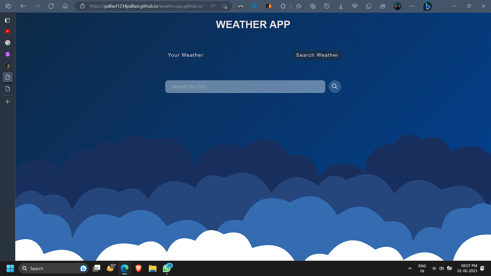
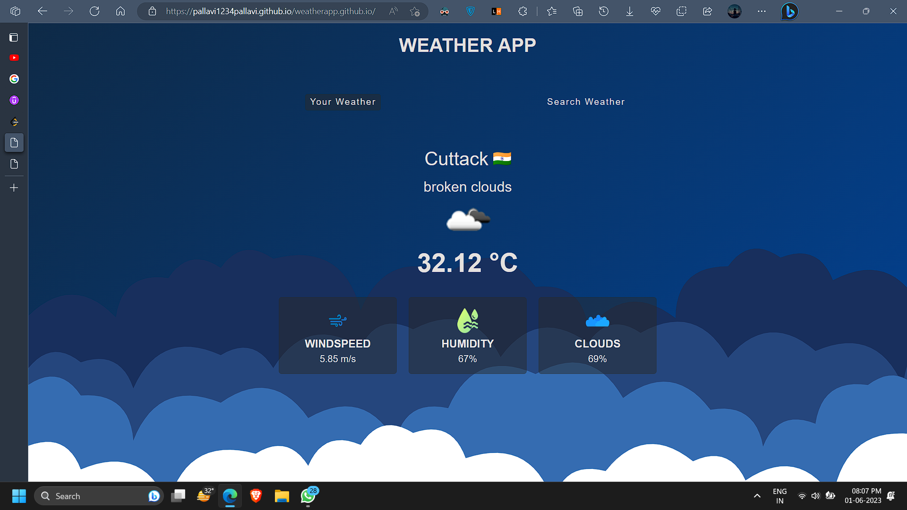

 
 # Weather App
 
 This is a simple weather app that uses the OpenWeatherMap API to fetch and display current weather conditions for the user’s location. Additionally, you can also search for any locations to get the weather info.
 
 ## The Application 📜
 
 
 
 
 
 ## Featues🪶
 * Displays current weather conditions for the user’s location
 * Uses the [OpenWeatherMap API](https://openweathermap.org/api) to fetch weather information
 * Search for weather info of other locations using the provided search bar
 
 ## Techonologies Used⚙️
 * HTML
 * CSS
 * Javascript
 * OpenWeatherMap API
 * GitHub Pages for hosting
 
 ## Contributions😊
 
 Contributions to this project are welcome! If you would like to contribute, please follow these steps:

* Fork this repository and create a new branch for your changes.
* Make your changes and commit them to your branch.
* Open a pull request to merge your changes into the main branch of this repository.

### Please ⭐ the repo if you liked it!
